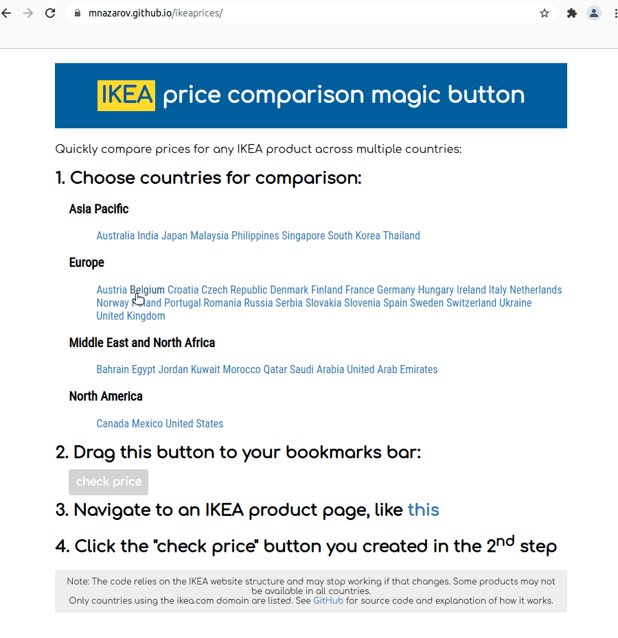

# IKEA price comparison magic button

A customizable magic button (bookmarklet) to compare IKEA prices across countries.

Try it! &rightarrow; http://mnazarov.github.io/ikeaprices




# Idea

Living in a small country like Belgium, sometimes it pays to drive over the border to get a good deal.
Depending on the location in Belgium, within 1-2 hours it is possible to reach IKEA in the Netherlands, Germany or France.
Out of desire to save and curiosity this tool was born.

# Implementation

Since most of the IKEA international websites are located at the same www.ikea.com domain, we can use client-side AJAX requests to other country websites from any product page, favorites list or shopping cart.
Unfortunately there are some exceptions, such as www.ikea.lt or www.ikea.cn, and this approach won't work for them because of Cross-Origin Resource Sharing (CORS) policies.

The product URLs have the following structure: www\.ikea.com/**xx**/**yy**/p/**zzz**/
   
where **xx** is the country code (like "be" or "gb"), **yy** is the language code ("nl" or "en"), and **zzz** is the product description with article number (like _kyrre-kruk-berken-60416925_) or just article number prefixed with "-".
Luckily for us, even if the product description part of the URL is language-specific, the same links still work when changing the country/language combination. 

## Product pages

Now, starting from a product page we can perform the following steps:

1. Get the URL of the current page and split it into country and product information parts:
   ```js
   var url = window.location.pathname; 
   var country = url.slice(1, 6);    // e.g. "be/nl"
   var urlProduct = url.slice(6, );  // e.g. "kyrre-kruk-berken-60416925"
   ```
2. Make a list of countries we want to compare to, and for each of the country/language codes fetch the corresponding page:
   ```js
   fetch("https://www.ikea.com/" + countryToCompare + urlProduct)
   ```
3. Parse it to find the price - we use the `div` element with class `range-revamp-pip-price-package__main-price` which contains the price together with the currency symbol:
   ```js
   var doc = new DOMParser().parseFromString(data, "text/html");
   var price = doc.evaluate("//div[@class='range-revamp-pip-price-package__main-price']", doc, null, 4, null).iterateNext().textContent;
   ```
4. Show it on the current page by creating an element (linking to the
   country page) and appending it to the currently shown price which can be
   found with:
   ```js
   document.querySelector("div.range-revamp-pip-price-package__main-price").appendChild(...)
   ``` 

## Favorites list and shopping cart pages

Using similar ideas, we can extend the functionality to pages with multiple products, such as favorites lists and shopping carts.
Instead of the 1st step above, we identify products on the page and their product URLs, then we fetch the prices for each product as described in steps 2 and 3 above, and finally display the obtained prices on the page.

The full code can be consulted in the [ikea.js](ikea.js) file in the repostiory.
